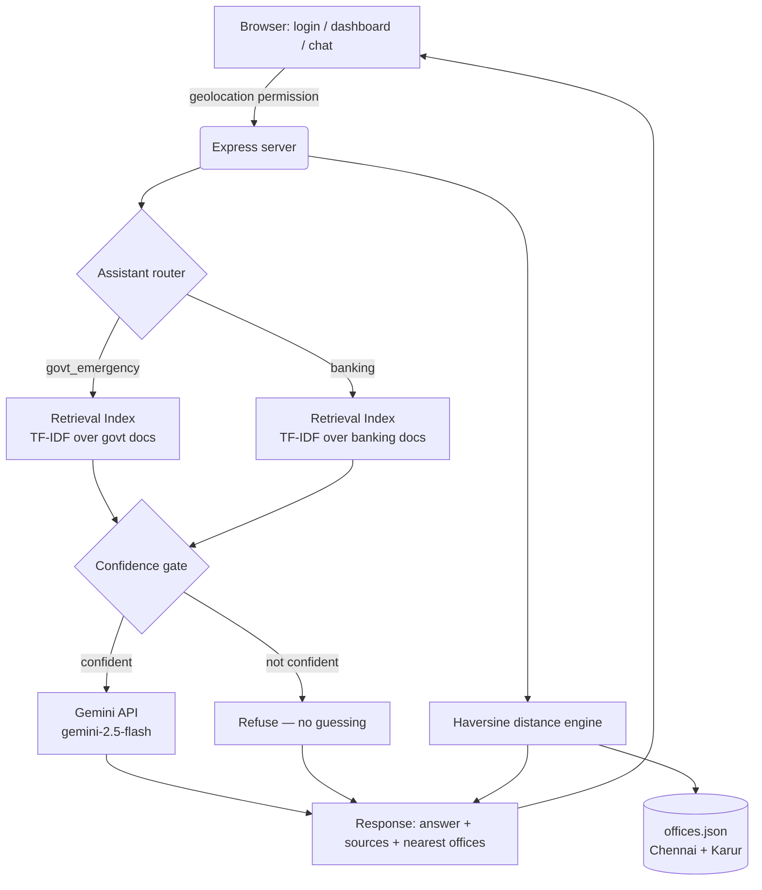

# Civic Assist — Government Emergency & Banking RAG Assistant
# Civic Assist — Government Emergency & Banking Assistant

**🔗 Live app:** [https://civic-assist-uaj6.onrender.com/login.html](https://civic-assist-uaj6.onrender.com/login.html)

A standalone RAG-grounded assistant for Indian citizens — two specialized chat windows for **Government & Emergency Services** and **Banking & Financial Services** — built with Node.js, the free Gemini API, and live browser geolocation. No paid APIs required.

---

## ✨ Features

| Feature | How it works |
|---|---|
| 🧠 Grounded answers | Local TF-IDF retrieval over curated `.txt` documents — no invented facts |
| 🚫 Confidence gate | Refuses to answer if nothing in the knowledge base is a good match |
| 🚨 Emergency detection | Keyword-triggered structured response: emergency level, helpline number, nearest office |
| 🚩 Fraud red-flag check | Flags suspicious banking/investment language, never confirms something is "safe" |
| 📍 Live location | Browser geolocation → nearest hospital, police, RTO, bank branch, ATM, etc. via Haversine distance |
| 🗺️ Maps | Google Maps deep link + ISRO Bhuvan geoportal link, no API key needed |
| 🔐 Auth | Username / mobile number + password login, sessions via `express-session` |
| 💬 Sample prompts | Tappable suggestion chips so first-time users don't need to know what to ask |

---

## 🏗️ Architecture



---

## 🔄 Request pipeline

1. **Auth** — user signs in (username/mobile + password), session cookie issued
2. **Location** — browser shares live lat/lon (with permission) on the dashboard and chat pages
3. **Message sent** — `POST /api/assistant/:assistantId/chat`
4. **Retrieval** — query scored via TF-IDF cosine similarity against that assistant's document set
5. **Confidence gate** — score + term-overlap checked; below threshold → refusal, no LLM call
6. **Keyword detectors** — emergency phrases (e.g. "gas leak") or fraud phrases (e.g. "guaranteed returns") trigger structured responses
7. **Generation** — Gemini composes the final answer, strictly grounded in retrieved chunks
8. **Location matching** — nearest relevant office (by category, not just distance) attached to the reply
9. **Response rendered** — answer + confidence + source + map links shown in chat

---

## 🛠️ Tech stack

| Layer | Choice |
|---|---|
| Backend | Node.js, Express |
| LLM | Google Gemini API (`gemini-2.5-flash`, free tier) |
| Retrieval | Custom local TF-IDF (no vector DB, no embeddings API) |
| Auth | `express-session` + `bcryptjs`, JSON file store |
| Location | Browser Geolocation API + Haversine formula (no Maps API key) |
| Frontend | Vanilla HTML/CSS/JS |
| Hosting | Render (free tier) |

---

## 🚀 Run it locally

```bash
git clone https://github.com/LogabalajiGovindharaj/civic-assist.git
cd civic-assist
npm install
cp .env.example .env   # add your free Gemini key from aistudio.google.com/app/apikey
npm start
```

Open `http://localhost:3000`.

---

## ⚠️ Scope notes

- Office database currently covers **Chennai and Karur** only — add your own city to `server/data/offices.json`
- User accounts are stored in a plain JSON file — fine for demo use, swap for a real database before production
- Free Render tier spins down after inactivity — first request after idle may take ~30–50s

